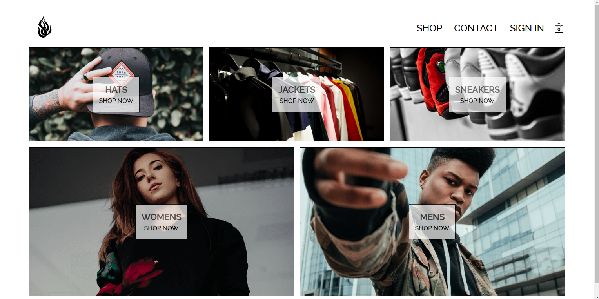
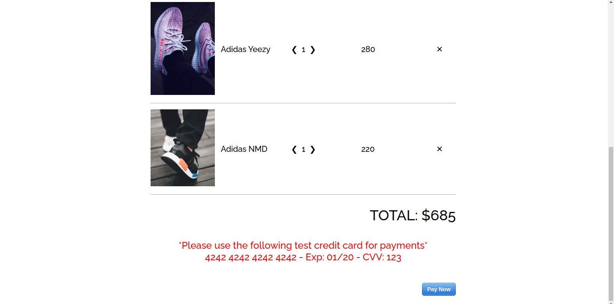

This is a fully functioning Ecommerce application that models a clothing shop!
---------------------------------
Built from scratch using React, Redux, Hooks, Firebase, and Stripe.

This is a fully reactive application with advanced React concepts such as Redux, Redux Thunk, Redux Saga, and Hooks integrated in the whole project. Firebase has been integrated into the frontend as well as backend to handle user sign-in and sign-up as well as google authentication connected. A full Stripe integration has been implemented as well to model real-time payments for companies utilitizing Stripe. This project helped me out a ton with React architecture, writing clean React code, and how to plan out and model projects for the future! Check out some of the images below to see the final product as well as visiting the application to interact with it personally!

---------------------------------
  
---------------------------------
  
---------------------------------
  
---------------------------------
